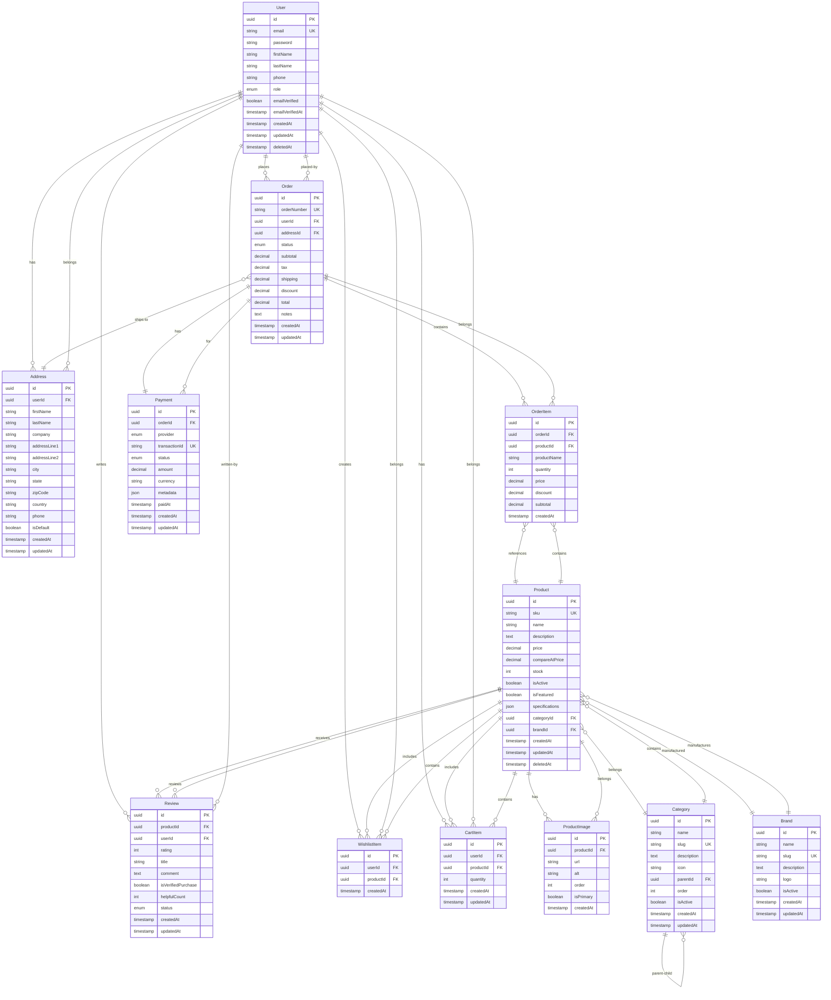

# 📊 Documentación de Base de Datos - Berrio E-commerce

## Índice

1. [Visión General](#visión-general)
2. [Diagrama ER](#diagrama-er)
3. [Diccionario de Datos](#diccionario-de-datos)
4. [Esquema de Base de Datos](#esquema-de-base-de-datos)
5. [Índices y Optimizaciones](#índices-y-optimizaciones)
6. [Migraciones](#migraciones)
7. [Procedimientos y Triggers](#procedimientos-y-triggers)
8. [Backup y Recuperación](#backup-y-recuperación)

---

## Visión General

### Tecnología

- **DBMS**: PostgreSQL 16
- **ORM**: Prisma 5
- **Migraciones**: Prisma Migrate
- **Charset**: UTF-8
- **Collation**: es_ES.UTF-8

### Arquitectura de Datos

- **Modelo**: Relacional normalizado (3NF)
- **Integridad Referencial**: Sí (Foreign Keys con ON DELETE CASCADE/RESTRICT)
- **Soft Deletes**: Implementado con campo `deletedAt`
- **Auditoría**: Campos `createdAt` y `updatedAt` en todas las tablas
- **Versionado**: Tabla `migrations` para tracking de cambios

### Características

- ✅ ACID Compliance
- ✅ Row-Level Security (RLS)
- ✅ Full-Text Search (PostgreSQL FTS)
- ✅ JSON/JSONB support para datos flexibles
- ✅ UUID como identificadores primarios
- ✅ Timestamps automáticos
- ✅ Soft deletes
- ✅ Índices optimizados
- ✅ Constraints de validación

---

## Diagrama ER



---

## Diccionario de Datos

### Tabla: `User`

**Descripción**: Almacena información de usuarios del sistema (clientes y administradores).

| Campo             | Tipo         | Nulo | Default            | Descripción                        |
| ----------------- | ------------ | ---- | ------------------ | ---------------------------------- |
| `id`              | UUID         | No   | uuid_generate_v4() | Identificador único del usuario    |
| `email`           | VARCHAR(255) | No   | -                  | Correo electrónico (único)         |
| `password`        | VARCHAR(255) | No   | -                  | Contraseña hasheada (bcrypt)       |
| `firstName`       | VARCHAR(100) | Sí   | -                  | Nombre(s) del usuario              |
| `lastName`        | VARCHAR(100) | Sí   | -                  | Apellido(s) del usuario            |
| `phone`           | VARCHAR(20)  | Sí   | -                  | Número telefónico                  |
| `role`            | ENUM         | No   | 'CUSTOMER'         | Rol: CUSTOMER, ADMIN, SUPER_ADMIN  |
| `emailVerified`   | BOOLEAN      | No   | false              | Estado de verificación de email    |
| `emailVerifiedAt` | TIMESTAMP    | Sí   | -                  | Fecha de verificación de email     |
| `avatar`          | TEXT         | Sí   | -                  | URL de imagen de perfil            |
| `createdAt`       | TIMESTAMP    | No   | CURRENT_TIMESTAMP  | Fecha de creación                  |
| `updatedAt`       | TIMESTAMP    | No   | CURRENT_TIMESTAMP  | Fecha de última actualización      |
| `deletedAt`       | TIMESTAMP    | Sí   | -                  | Fecha de eliminación (soft delete) |

**Índices**:

- PRIMARY KEY: `id`
- UNIQUE: `email`
- INDEX: `role`, `createdAt`

**Constraints**:

- `email` debe ser válido (formato email)
- `password` mínimo 8 caracteres
- `role` debe estar en valores ENUM definidos

---

### Tabla: `Category`

**Descripción**: Categorías jerárquicas de productos.

| Campo         | Tipo         | Nulo | Default            | Descripción                             |
| ------------- | ------------ | ---- | ------------------ | --------------------------------------- |
| `id`          | UUID         | No   | uuid_generate_v4() | Identificador único                     |
| `name`        | VARCHAR(100) | No   | -                  | Nombre de la categoría                  |
| `slug`        | VARCHAR(100) | No   | -                  | Slug para URLs (único)                  |
| `description` | TEXT         | Sí   | -                  | Descripción de la categoría             |
| `icon`        | VARCHAR(50)  | Sí   | -                  | Icono representativo                    |
| `parentId`    | UUID         | Sí   | -                  | ID de categoría padre (auto-referencia) |
| `order`       | INTEGER      | No   | 0                  | Orden de visualización                  |
| `isActive`    | BOOLEAN      | No   | true               | Estado activo/inactivo                  |
| `createdAt`   | TIMESTAMP    | No   | CURRENT_TIMESTAMP  | Fecha de creación                       |
| `updatedAt`   | TIMESTAMP    | No   | CURRENT_TIMESTAMP  | Fecha de actualización                  |

**Índices**:

- PRIMARY KEY: `id`
- UNIQUE: `slug`
- INDEX: `parentId`, `isActive`, `order`
- FOREIGN KEY: `parentId` REFERENCES `Category(id)` ON DELETE CASCADE

**Constraints**:

- `slug` debe ser lowercase y sin espacios
- `order` >= 0

---

### Tabla: `Brand`

**Descripción**: Marcas de productos electrónicos.

| Campo         | Tipo         | Nulo | Default            | Descripción             |
| ------------- | ------------ | ---- | ------------------ | ----------------------- |
| `id`          | UUID         | No   | uuid_generate_v4() | Identificador único     |
| `name`        | VARCHAR(100) | No   | -                  | Nombre de la marca      |
| `slug`        | VARCHAR(100) | No   | -                  | Slug para URLs (único)  |
| `description` | TEXT         | Sí   | -                  | Descripción de la marca |
| `logo`        | TEXT         | Sí   | -                  | URL del logotipo        |
| `website`     | VARCHAR(255) | Sí   | -                  | Sitio web oficial       |
| `isActive`    | BOOLEAN      | No   | true               | Estado activo/inactivo  |
| `createdAt`   | TIMESTAMP    | No   | CURRENT_TIMESTAMP  | Fecha de creación       |
| `updatedAt`   | TIMESTAMP    | No   | CURRENT_TIMESTAMP  | Fecha de actualización  |

**Índices**:

- PRIMARY KEY: `id`
- UNIQUE: `slug`
- INDEX: `isActive`, `name`

---

### Tabla: `Product`

**Descripción**: Productos disponibles en la tienda.

| Campo               | Tipo          | Nulo | Default            | Descripción                      |
| ------------------- | ------------- | ---- | ------------------ | -------------------------------- |
| `id`                | UUID          | No   | uuid_generate_v4() | Identificador único              |
| `sku`               | VARCHAR(50)   | No   | -                  | Código SKU (único)               |
| `name`              | VARCHAR(255)  | No   | -                  | Nombre del producto              |
| `slug`              | VARCHAR(255)  | No   | -                  | Slug para URLs (único)           |
| `description`       | TEXT          | Sí   | -                  | Descripción detallada            |
| `shortDescription`  | VARCHAR(500)  | Sí   | -                  | Descripción corta                |
| `price`             | DECIMAL(10,2) | No   | -                  | Precio actual                    |
| `compareAtPrice`    | DECIMAL(10,2) | Sí   | -                  | Precio antes de descuento        |
| `cost`              | DECIMAL(10,2) | Sí   | -                  | Costo del producto               |
| `stock`             | INTEGER       | No   | 0                  | Cantidad en inventario           |
| `lowStockThreshold` | INTEGER       | No   | 5                  | Umbral de stock bajo             |
| `weight`            | DECIMAL(8,2)  | Sí   | -                  | Peso en gramos                   |
| `dimensions`        | JSONB         | Sí   | -                  | Dimensiones (largo, ancho, alto) |
| `specifications`    | JSONB         | Sí   | -                  | Especificaciones técnicas        |
| `categoryId`        | UUID          | Sí   | -                  | ID de categoría                  |
| `brandId`           | UUID          | Sí   | -                  | ID de marca                      |
| `isActive`          | BOOLEAN       | No   | true               | Estado activo/inactivo           |
| `isFeatured`        | BOOLEAN       | No   | false              | Producto destacado               |
| `metaTitle`         | VARCHAR(255)  | Sí   | -                  | Meta título SEO                  |
| `metaDescription`   | TEXT          | Sí   | -                  | Meta descripción SEO             |
| `createdAt`         | TIMESTAMP     | No   | CURRENT_TIMESTAMP  | Fecha de creación                |
| `updatedAt`         | TIMESTAMP     | No   | CURRENT_TIMESTAMP  | Fecha de actualización           |
| `deletedAt`         | TIMESTAMP     | Sí   | -                  | Fecha de eliminación             |

**Índices**:

- PRIMARY KEY: `id`
- UNIQUE: `sku`, `slug`
- INDEX: `categoryId`, `brandId`, `isActive`, `isFeatured`, `price`
- FULLTEXT: `name`, `description` (para búsqueda)
- FOREIGN KEY: `categoryId` REFERENCES `Category(id)` ON DELETE SET NULL
- FOREIGN KEY: `brandId` REFERENCES `Brand(id)` ON DELETE SET NULL

**Constraints**:

- `price` > 0
- `stock` >= 0
- `compareAtPrice` >= `price` (si existe)

---

### Tabla: `ProductImage`

**Descripción**: Imágenes asociadas a productos.

| Campo       | Tipo         | Nulo | Default            | Descripción            |
| ----------- | ------------ | ---- | ------------------ | ---------------------- |
| `id`        | UUID         | No   | uuid_generate_v4() | Identificador único    |
| `productId` | UUID         | No   | -                  | ID del producto        |
| `url`       | TEXT         | No   | -                  | URL de la imagen       |
| `alt`       | VARCHAR(255) | Sí   | -                  | Texto alternativo      |
| `order`     | INTEGER      | No   | 0                  | Orden de visualización |
| `isPrimary` | BOOLEAN      | No   | false              | Imagen principal       |
| `createdAt` | TIMESTAMP    | No   | CURRENT_TIMESTAMP  | Fecha de creación      |

**Índices**:

- PRIMARY KEY: `id`
- INDEX: `productId`, `order`, `isPrimary`
- FOREIGN KEY: `productId` REFERENCES `Product(id)` ON DELETE CASCADE

---

### Tabla: `Order`

**Descripción**: Órdenes de compra realizadas.

| Campo            | Tipo          | Nulo | Default            | Descripción                                                             |
| ---------------- | ------------- | ---- | ------------------ | ----------------------------------------------------------------------- |
| `id`             | UUID          | No   | uuid_generate_v4() | Identificador único                                                     |
| `orderNumber`    | VARCHAR(20)   | No   | -                  | Número de orden (único)                                                 |
| `userId`         | UUID          | Sí   | -                  | ID del usuario (null para invitados)                                    |
| `email`          | VARCHAR(255)  | No   | -                  | Email del comprador                                                     |
| `addressId`      | UUID          | No   | -                  | ID de dirección de envío                                                |
| `status`         | ENUM          | No   | 'PENDING'          | PENDING, CONFIRMED, PROCESSING, SHIPPED, DELIVERED, CANCELLED, REFUNDED |
| `paymentStatus`  | ENUM          | No   | 'PENDING'          | PENDING, PAID, FAILED, REFUNDED                                         |
| `subtotal`       | DECIMAL(10,2) | No   | 0                  | Subtotal de productos                                                   |
| `tax`            | DECIMAL(10,2) | No   | 0                  | Impuestos                                                               |
| `shipping`       | DECIMAL(10,2) | No   | 0                  | Costo de envío                                                          |
| `discount`       | DECIMAL(10,2) | No   | 0                  | Descuento aplicado                                                      |
| `total`          | DECIMAL(10,2) | No   | 0                  | Total a pagar                                                           |
| `currency`       | VARCHAR(3)    | No   | 'USD'              | Moneda (ISO 4217)                                                       |
| `notes`          | TEXT          | Sí   | -                  | Notas del cliente                                                       |
| `trackingNumber` | VARCHAR(100)  | Sí   | -                  | Número de seguimiento                                                   |
| `trackingUrl`    | TEXT          | Sí   | -                  | URL de tracking                                                         |
| `shippedAt`      | TIMESTAMP     | Sí   | -                  | Fecha de envío                                                          |
| `deliveredAt`    | TIMESTAMP     | Sí   | -                  | Fecha de entrega                                                        |
| `cancelledAt`    | TIMESTAMP     | Sí   | -                  | Fecha de cancelación                                                    |
| `createdAt`      | TIMESTAMP     | No   | CURRENT_TIMESTAMP  | Fecha de creación                                                       |
| `updatedAt`      | TIMESTAMP     | No   | CURRENT_TIMESTAMP  | Fecha de actualización                                                  |

**Índices**:

- PRIMARY KEY: `id`
- UNIQUE: `orderNumber`
- INDEX: `userId`, `email`, `status`, `paymentStatus`, `createdAt`
- FOREIGN KEY: `userId` REFERENCES `User(id)` ON DELETE SET NULL
- FOREIGN KEY: `addressId` REFERENCES `Address(id)` ON DELETE RESTRICT

**Constraints**:

- `total` >= 0
- `orderNumber` formato: ORD-YYYYMMDD-XXXXX

---

### Tabla: `OrderItem`

**Descripción**: Items/productos de cada orden.

| Campo          | Tipo          | Nulo | Default            | Descripción                        |
| -------------- | ------------- | ---- | ------------------ | ---------------------------------- |
| `id`           | UUID          | No   | uuid_generate_v4() | Identificador único                |
| `orderId`      | UUID          | No   | -                  | ID de la orden                     |
| `productId`    | UUID          | No   | -                  | ID del producto                    |
| `productName`  | VARCHAR(255)  | No   | -                  | Nombre del producto (snapshot)     |
| `productSku`   | VARCHAR(50)   | No   | -                  | SKU del producto (snapshot)        |
| `productImage` | TEXT          | Sí   | -                  | URL imagen (snapshot)              |
| `quantity`     | INTEGER       | No   | 1                  | Cantidad ordenada                  |
| `price`        | DECIMAL(10,2) | No   | -                  | Precio unitario                    |
| `discount`     | DECIMAL(10,2) | No   | 0                  | Descuento por item                 |
| `subtotal`     | DECIMAL(10,2) | No   | -                  | Subtotal (qty \* price - discount) |
| `createdAt`    | TIMESTAMP     | No   | CURRENT_TIMESTAMP  | Fecha de creación                  |

**Índices**:

- PRIMARY KEY: `id`
- INDEX: `orderId`, `productId`
- FOREIGN KEY: `orderId` REFERENCES `Order(id)` ON DELETE CASCADE
- FOREIGN KEY: `productId` REFERENCES `Product(id)` ON DELETE RESTRICT

**Constraints**:

- `quantity` > 0
- `price` > 0

---

### Tabla: `Payment`

**Descripción**: Pagos asociados a órdenes.

| Campo           | Tipo          | Nulo | Default            | Descripción                                      |
| --------------- | ------------- | ---- | ------------------ | ------------------------------------------------ |
| `id`            | UUID          | No   | uuid_generate_v4() | Identificador único                              |
| `orderId`       | UUID          | No   | -                  | ID de la orden                                   |
| `provider`      | ENUM          | No   | -                  | STRIPE, PAYPAL, CREDIT_CARD                      |
| `transactionId` | VARCHAR(255)  | Sí   | -                  | ID de transacción externo                        |
| `status`        | ENUM          | No   | 'PENDING'          | PENDING, PROCESSING, COMPLETED, FAILED, REFUNDED |
| `amount`        | DECIMAL(10,2) | No   | -                  | Monto pagado                                     |
| `currency`      | VARCHAR(3)    | No   | 'USD'              | Moneda                                           |
| `paymentMethod` | VARCHAR(50)   | Sí   | -                  | Método: card, paypal, etc                        |
| `last4`         | VARCHAR(4)    | Sí   | -                  | Últimos 4 dígitos tarjeta                        |
| `cardBrand`     | VARCHAR(20)   | Sí   | -                  | Visa, Mastercard, etc                            |
| `metadata`      | JSONB         | Sí   | -                  | Datos adicionales                                |
| `errorMessage`  | TEXT          | Sí   | -                  | Mensaje de error (si aplica)                     |
| `paidAt`        | TIMESTAMP     | Sí   | -                  | Fecha de pago exitoso                            |
| `refundedAt`    | TIMESTAMP     | Sí   | -                  | Fecha de reembolso                               |
| `createdAt`     | TIMESTAMP     | No   | CURRENT_TIMESTAMP  | Fecha de creación                                |
| `updatedAt`     | TIMESTAMP     | No   | CURRENT_TIMESTAMP  | Fecha de actualización                           |

**Índices**:

- PRIMARY KEY: `id`
- INDEX: `orderId`, `transactionId`, `status`
- FOREIGN KEY: `orderId` REFERENCES `Order(id)` ON DELETE CASCADE

---

### Tabla: `Address`

**Descripción**: Direcciones de envío de usuarios.

| Campo          | Tipo         | Nulo | Default            | Descripción              |
| -------------- | ------------ | ---- | ------------------ | ------------------------ |
| `id`           | UUID         | No   | uuid_generate_v4() | Identificador único      |
| `userId`       | UUID         | No   | -                  | ID del usuario           |
| `firstName`    | VARCHAR(100) | No   | -                  | Nombre                   |
| `lastName`     | VARCHAR(100) | No   | -                  | Apellido                 |
| `company`      | VARCHAR(100) | Sí   | -                  | Empresa                  |
| `addressLine1` | VARCHAR(255) | No   | -                  | Línea dirección 1        |
| `addressLine2` | VARCHAR(255) | Sí   | -                  | Línea dirección 2        |
| `city`         | VARCHAR(100) | No   | -                  | Ciudad                   |
| `state`        | VARCHAR(100) | No   | -                  | Estado/Provincia         |
| `zipCode`      | VARCHAR(20)  | No   | -                  | Código postal            |
| `country`      | VARCHAR(2)   | No   | -                  | Código país (ISO 3166-1) |
| `phone`        | VARCHAR(20)  | No   | -                  | Teléfono                 |
| `isDefault`    | BOOLEAN      | No   | false              | Dirección por defecto    |
| `createdAt`    | TIMESTAMP    | No   | CURRENT_TIMESTAMP  | Fecha de creación        |
| `updatedAt`    | TIMESTAMP    | No   | CURRENT_TIMESTAMP  | Fecha de actualización   |

**Índices**:

- PRIMARY KEY: `id`
- INDEX: `userId`, `isDefault`
- FOREIGN KEY: `userId` REFERENCES `User(id)` ON DELETE CASCADE

---

### Tabla: `Review`

**Descripción**: Reseñas de productos.

| Campo                | Tipo         | Nulo | Default            | Descripción                 |
| -------------------- | ------------ | ---- | ------------------ | --------------------------- |
| `id`                 | UUID         | No   | uuid_generate_v4() | Identificador único         |
| `productId`          | UUID         | No   | -                  | ID del producto             |
| `userId`             | UUID         | No   | -                  | ID del usuario              |
| `rating`             | INTEGER      | No   | -                  | Calificación (1-5)          |
| `title`              | VARCHAR(255) | Sí   | -                  | Título de la reseña         |
| `comment`            | TEXT         | Sí   | -                  | Comentario                  |
| `isVerifiedPurchase` | BOOLEAN      | No   | false              | Compra verificada           |
| `helpfulCount`       | INTEGER      | No   | 0                  | Contador de útiles          |
| `status`             | ENUM         | No   | 'PENDING'          | PENDING, APPROVED, REJECTED |
| `createdAt`          | TIMESTAMP    | No   | CURRENT_TIMESTAMP  | Fecha de creación           |
| `updatedAt`          | TIMESTAMP    | No   | CURRENT_TIMESTAMP  | Fecha de actualización      |

**Índices**:

- PRIMARY KEY: `id`
- INDEX: `productId`, `userId`, `status`, `rating`
- FOREIGN KEY: `productId` REFERENCES `Product(id)` ON DELETE CASCADE
- FOREIGN KEY: `userId` REFERENCES `User(id)` ON DELETE CASCADE

**Constraints**:

- `rating` BETWEEN 1 AND 5
- UNIQUE (`productId`, `userId`) - Un usuario solo puede reseñar una vez por producto

---

### Tabla: `CartItem`

**Descripción**: Items del carrito de compras.

| Campo       | Tipo      | Nulo | Default            | Descripción            |
| ----------- | --------- | ---- | ------------------ | ---------------------- |
| `id`        | UUID      | No   | uuid_generate_v4() | Identificador único    |
| `userId`    | UUID      | No   | -                  | ID del usuario         |
| `productId` | UUID      | No   | -                  | ID del producto        |
| `quantity`  | INTEGER   | No   | 1                  | Cantidad               |
| `createdAt` | TIMESTAMP | No   | CURRENT_TIMESTAMP  | Fecha de creación      |
| `updatedAt` | TIMESTAMP | No   | CURRENT_TIMESTAMP  | Fecha de actualización |

**Índices**:

- PRIMARY KEY: `id`
- INDEX: `userId`, `productId`
- UNIQUE: (`userId`, `productId`)
- FOREIGN KEY: `userId` REFERENCES `User(id)` ON DELETE CASCADE
- FOREIGN KEY: `productId` REFERENCES `Product(id)` ON DELETE CASCADE

**Constraints**:

- `quantity` > 0

---

### Tabla: `WishlistItem`

**Descripción**: Lista de deseos de usuarios.

| Campo       | Tipo      | Nulo | Default            | Descripción         |
| ----------- | --------- | ---- | ------------------ | ------------------- |
| `id`        | UUID      | No   | uuid_generate_v4() | Identificador único |
| `userId`    | UUID      | No   | -                  | ID del usuario      |
| `productId` | UUID      | No   | -                  | ID del producto     |
| `createdAt` | TIMESTAMP | No   | CURRENT_TIMESTAMP  | Fecha de creación   |

**Índices**:

- PRIMARY KEY: `id`
- UNIQUE: (`userId`, `productId`)
- INDEX: `userId`, `productId`
- FOREIGN KEY: `userId` REFERENCES `User(id)` ON DELETE CASCADE
- FOREIGN KEY: `productId` REFERENCES `Product(id)` ON DELETE CASCADE

---

## Esquema de Base de Datos

Ver archivo: [schema.prisma](../../packages/database/prisma/schema.prisma)

---

## Índices y Optimizaciones

### Índices Principales

1. **Búsqueda de Productos**

```sql
CREATE INDEX idx_product_search ON Product USING GIN (
  to_tsvector('spanish', name || ' ' || COALESCE(description, ''))
);
```

2. **Filtros de Productos**

```sql
CREATE INDEX idx_product_filters ON Product (categoryId, brandId, price, isActive);
CREATE INDEX idx_product_price ON Product (price) WHERE isActive = true;
```

3. **Órdenes de Usuario**

```sql
CREATE INDEX idx_order_user_date ON "Order" (userId, createdAt DESC);
CREATE INDEX idx_order_status ON "Order" (status, createdAt DESC);
```

4. **Performance de Cart**

```sql
CREATE INDEX idx_cart_user_updated ON CartItem (userId, updatedAt DESC);
```

### Estrategias de Caché

1. **Redis Cache Keys**:
   - `product:{id}` - Detalles de producto (TTL: 1h)
   - `products:featured` - Productos destacados (TTL: 30min)
   - `category:{id}:products` - Productos por categoría (TTL: 15min)
   - `cart:{userId}` - Carrito de usuario (TTL: 24h)

2. **PostgreSQL Query Cache**:
   - Shared buffers: 25% RAM
   - Effective cache size: 75% RAM

---

## Migraciones

Ver carpeta: [migrations](../../packages/database/prisma/migrations)

### Ejecutar Migraciones

```bash
# Desarrollo
pnpm db:migrate:dev

# Producción
pnpm db:migrate

# Rollback (manual)
pnpm db:migrate:resolve --rolled-back "migration_name"
```

---

## Procedimientos y Triggers

### 1. Actualizar Stock al Confirmar Orden

```sql
CREATE OR REPLACE FUNCTION update_product_stock()
RETURNS TRIGGER AS $$
BEGIN
  IF NEW.status = 'CONFIRMED' AND OLD.status != 'CONFIRMED' THEN
    UPDATE Product p
    SET stock = stock - oi.quantity
    FROM OrderItem oi
    WHERE oi.productId = p.id AND oi.orderId = NEW.id;
  END IF;
  RETURN NEW;
END;
$$ LANGUAGE plpgsql;

CREATE TRIGGER trigger_update_stock
AFTER UPDATE ON "Order"
FOR EACH ROW
EXECUTE FUNCTION update_product_stock();
```

### 2. Validar Stock Antes de Checkout

```sql
CREATE OR REPLACE FUNCTION validate_stock()
RETURNS TRIGGER AS $$
DECLARE
  current_stock INTEGER;
BEGIN
  SELECT stock INTO current_stock
  FROM Product
  WHERE id = NEW.productId;

  IF current_stock < NEW.quantity THEN
    RAISE EXCEPTION 'Stock insuficiente para el producto %', NEW.productId;
  END IF;

  RETURN NEW;
END;
$$ LANGUAGE plpgsql;

CREATE TRIGGER trigger_validate_stock
BEFORE INSERT ON OrderItem
FOR EACH ROW
EXECUTE FUNCTION validate_stock();
```

### 3. Actualizar Rating Promedio de Producto

```sql
CREATE OR REPLACE FUNCTION update_product_rating()
RETURNS TRIGGER AS $$
BEGIN
  UPDATE Product
  SET
    averageRating = (
      SELECT AVG(rating)::DECIMAL(3,2)
      FROM Review
      WHERE productId = NEW.productId AND status = 'APPROVED'
    ),
    reviewCount = (
      SELECT COUNT(*)
      FROM Review
      WHERE productId = NEW.productId AND status = 'APPROVED'
    )
  WHERE id = NEW.productId;

  RETURN NEW;
END;
$$ LANGUAGE plpgsql;

CREATE TRIGGER trigger_update_rating
AFTER INSERT OR UPDATE ON Review
FOR EACH ROW
EXECUTE FUNCTION update_product_rating();
```

---

## Backup y Recuperación

### Backup Automático Diario

```bash
#!/bin/bash
# backup.sh
BACKUP_DIR="/backups/postgres"
DATE=$(date +%Y%m%d_%H%M%S)
PGPASSWORD=$POSTGRES_PASSWORD pg_dump -h localhost -U postgres -d berrio_ecommerce -F c -f "$BACKUP_DIR/backup_$DATE.dump"

# Retener solo últimos 30 días
find $BACKUP_DIR -type f -mtime +30 -delete
```

### Restaurar Backup

```bash
pg_restore -h localhost -U postgres -d berrio_ecommerce -c /path/to/backup.dump
```

### Replicación (Producción)

- **Primary-Standby Replication**
- **Read Replicas** para queries pesadas
- **Point-in-Time Recovery (PITR)**

---

## Consultas de Ejemplo

### 1. Productos más vendidos

```sql
SELECT
  p.id,
  p.name,
  SUM(oi.quantity) as total_sold,
  COUNT(DISTINCT o.id) as order_count
FROM Product p
JOIN OrderItem oi ON p.id = oi.productId
JOIN "Order" o ON oi.orderId = o.id
WHERE o.status IN ('CONFIRMED', 'SHIPPED', 'DELIVERED')
GROUP BY p.id, p.name
ORDER BY total_sold DESC
LIMIT 10;
```

### 2. Reporte de ventas por categoría

```sql
SELECT
  c.name as category,
  COUNT(DISTINCT o.id) as orders,
  SUM(oi.quantity) as units_sold,
  SUM(oi.subtotal) as revenue
FROM Category c
JOIN Product p ON c.id = p.categoryId
JOIN OrderItem oi ON p.id = oi.productId
JOIN "Order" o ON oi.orderId = o.id
WHERE o.createdAt >= CURRENT_DATE - INTERVAL '30 days'
  AND o.status != 'CANCELLED'
GROUP BY c.id, c.name
ORDER BY revenue DESC;
```

### 3. Clientes con mayor valor

```sql
SELECT
  u.id,
  u.email,
  u.firstName,
  u.lastName,
  COUNT(o.id) as order_count,
  SUM(o.total) as lifetime_value
FROM "User" u
JOIN "Order" o ON u.id = o.userId
WHERE o.status != 'CANCELLED'
GROUP BY u.id
ORDER BY lifetime_value DESC
LIMIT 100;
```

---

## Mantenimiento

### Tareas Regulares

1. **VACUUM** (semanal)

```sql
VACUUM ANALYZE;
```

2. **Reindexación** (mensual)

```sql
REINDEX DATABASE berrio_ecommerce;
```

3. **Análisis de Queries Lentas**

```sql
SELECT * FROM pg_stat_statements
ORDER BY mean_exec_time DESC
LIMIT 10;
```

---

## Seguridad

### Row-Level Security (RLS)

```sql
-- Los usuarios solo pueden ver sus propias órdenes
ALTER TABLE "Order" ENABLE ROW LEVEL SECURITY;

CREATE POLICY user_orders ON "Order"
  FOR ALL
  TO authenticated_user
  USING (userId = current_user_id());
```

### Encriptación

- **En tránsito**: SSL/TLS obligatorio
- **En reposo**: LUKS encryption para volúmenes
- **Campos sensibles**: Encriptación con pgcrypto

---

## Monitoreo

### Métricas Importantes

- Conexiones activas
- Query execution time
- Cache hit ratio
- Deadlocks
- Table bloat
- Replication lag

### Herramientas

- **pg_stat_statements**: Análisis de queries
- **pgBadger**: Log analyzer
- **Prometheus + Grafana**: Visualización
- **PgHero**: Dashboard web

---

## Referencias

- [PostgreSQL Documentation](https://www.postgresql.org/docs/16/)
- [Prisma Documentation](https://www.prisma.io/docs)
- [Database Best Practices](https://wiki.postgresql.org/wiki/Performance_Optimization)
