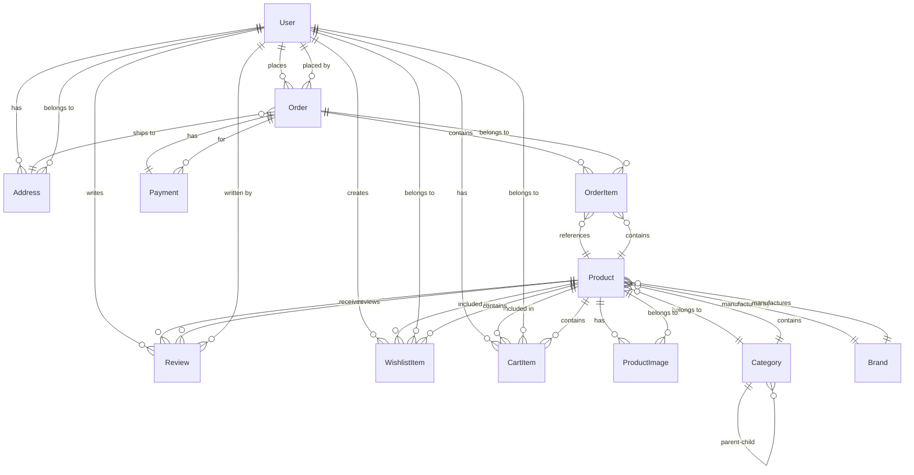
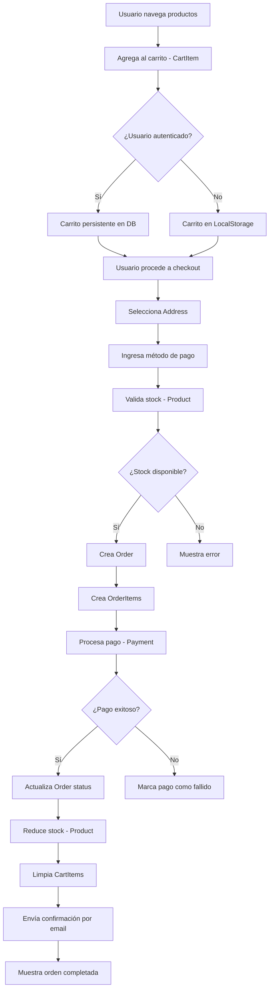
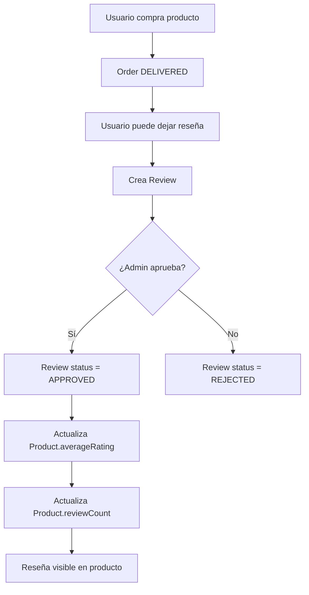

# 📊 Diagrama de Base de Datos

## Diagrama Entidad-Relación (ER)

Este documento proporciona una representación visual de la estructura de la base de datos del e-commerce.

### Diagrama Principal



### Leyenda

| Símbolo  | Significado     |
| -------- | --------------- | ----- | ------------ | --- | --------- |
| `        |                 | --o{` | Uno a muchos |
| `}o--    |                 | `     | Muchos a uno |
| `        |                 | --    |              | `   | Uno a uno |
| `}o--o{` | Muchos a muchos |

### Tablas Principales

#### 1. User (Usuarios)

Almacena información de usuarios del sistema (clientes y administradores).

**Campos principales:**

- `id` (PK): UUID único
- `email` (UK): Email del usuario
- `password`: Contraseña hasheada
- `role`: CUSTOMER | ADMIN | SUPER_ADMIN
- `emailVerified`: Boolean

**Relaciones:**

- 1:N con Order (un usuario puede tener muchas órdenes)
- 1:N con Address (un usuario puede tener muchas direcciones)
- 1:N con Review (un usuario puede escribir muchas reseñas)
- 1:N con CartItem (un usuario puede tener muchos items en carrito)
- 1:N con WishlistItem (un usuario puede tener muchos items en wishlist)

---

#### 2. Category (Categorías)

Categorías jerárquicas de productos.

**Campos principales:**

- `id` (PK): UUID único
- `name`: Nombre de categoría
- `slug` (UK): Slug para URLs
- `parentId` (FK): ID de categoría padre (auto-referencia)

**Relaciones:**

- 1:N con Product (una categoría puede tener muchos productos)
- Auto-relación para jerarquía (parent-child)

---

#### 3. Brand (Marcas)

Marcas de productos electrónicos.

**Campos principales:**

- `id` (PK): UUID único
- `name`: Nombre de marca
- `slug` (UK): Slug para URLs
- `logo`: URL del logotipo

**Relaciones:**

- 1:N con Product (una marca puede tener muchos productos)

---

#### 4. Product (Productos)

Productos disponibles en la tienda.

**Campos principales:**

- `id` (PK): UUID único
- `sku` (UK): Código SKU
- `name`: Nombre del producto
- `price`: Precio actual
- `stock`: Cantidad en inventario
- `categoryId` (FK): Referencia a Category
- `brandId` (FK): Referencia a Brand
- `specifications`: JSONB con especificaciones técnicas

**Relaciones:**

- N:1 con Category
- N:1 con Brand
- 1:N con ProductImage
- 1:N con OrderItem
- 1:N con Review
- 1:N con CartItem
- 1:N con WishlistItem

---

#### 5. ProductImage (Imágenes de Producto)

Imágenes asociadas a productos.

**Campos principales:**

- `id` (PK): UUID único
- `productId` (FK): Referencia a Product
- `url`: URL de la imagen
- `isPrimary`: Boolean (imagen principal)

**Relaciones:**

- N:1 con Product

---

#### 6. Order (Órdenes)

Órdenes de compra realizadas.

**Campos principales:**

- `id` (PK): UUID único
- `orderNumber` (UK): Número de orden
- `userId` (FK): Referencia a User
- `addressId` (FK): Referencia a Address
- `status`: ENUM (PENDING, CONFIRMED, etc.)
- `total`: Total a pagar

**Relaciones:**

- N:1 con User
- N:1 con Address
- 1:N con OrderItem
- 1:1 con Payment

---

#### 7. OrderItem (Items de Orden)

Productos individuales dentro de una orden.

**Campos principales:**

- `id` (PK): UUID único
- `orderId` (FK): Referencia a Order
- `productId` (FK): Referencia a Product
- `quantity`: Cantidad ordenada
- `price`: Precio al momento de compra

**Relaciones:**

- N:1 con Order
- N:1 con Product

---

#### 8. Payment (Pagos)

Pagos asociados a órdenes.

**Campos principales:**

- `id` (PK): UUID único
- `orderId` (FK): Referencia a Order
- `provider`: ENUM (STRIPE, PAYPAL, etc.)
- `status`: ENUM (PENDING, COMPLETED, etc.)
- `amount`: Monto pagado

**Relaciones:**

- 1:1 con Order

---

#### 9. Address (Direcciones)

Direcciones de envío de usuarios.

**Campos principales:**

- `id` (PK): UUID único
- `userId` (FK): Referencia a User
- `addressLine1`: Línea de dirección 1
- `city`: Ciudad
- `state`: Estado/Provincia
- `zipCode`: Código postal
- `country`: Código de país

**Relaciones:**

- N:1 con User
- 1:N con Order

---

#### 10. Review (Reseñas)

Reseñas de productos por usuarios.

**Campos principales:**

- `id` (PK): UUID único
- `productId` (FK): Referencia a Product
- `userId` (FK): Referencia a User
- `rating`: Calificación (1-5)
- `comment`: Comentario
- `status`: ENUM (PENDING, APPROVED, REJECTED)

**Relaciones:**

- N:1 con Product
- N:1 con User

**Constraint:**

- UNIQUE (productId, userId): Un usuario solo puede reseñar una vez por producto

---

#### 11. CartItem (Items de Carrito)

Items del carrito de compras de usuarios.

**Campos principales:**

- `id` (PK): UUID único
- `userId` (FK): Referencia a User
- `productId` (FK): Referencia a Product
- `quantity`: Cantidad

**Relaciones:**

- N:1 con User
- N:1 con Product

**Constraint:**

- UNIQUE (userId, productId): Un usuario no puede tener duplicados en su carrito

---

#### 12. WishlistItem (Items de Lista de Deseos)

Lista de deseos de usuarios.

**Campos principales:**

- `id` (PK): UUID único
- `userId` (FK): Referencia a User
- `productId` (FK): Referencia a Product

**Relaciones:**

- N:1 con User
- N:1 con Product

**Constraint:**

- UNIQUE (userId, productId): Un usuario no puede tener duplicados en su wishlist

---

## Diagrama de Flujo de Datos

### Flujo de Checkout



### Flujo de Reseñas



---

## Índices Importantes

### Performance Crítico

```sql
-- Búsqueda de productos
CREATE INDEX idx_product_search ON Product USING GIN (
  to_tsvector('spanish', name || ' ' || COALESCE(description, ''))
);

-- Filtros de productos
CREATE INDEX idx_product_filters ON Product (
  categoryId, brandId, price, isActive
);

-- Órdenes por usuario
CREATE INDEX idx_order_user_date ON "Order" (
  userId, createdAt DESC
);

-- Items de carrito
CREATE INDEX idx_cart_user ON CartItem (userId, updatedAt DESC);
```

---

## Triggers y Funciones

### 1. Actualizar timestamp automáticamente

```sql
CREATE OR REPLACE FUNCTION update_updated_at_column()
RETURNS TRIGGER AS $$
BEGIN
    NEW."updatedAt" = CURRENT_TIMESTAMP;
    RETURN NEW;
END;
$$ language 'plpgsql';

CREATE TRIGGER update_user_updated_at
    BEFORE UPDATE ON "User"
    FOR EACH ROW
    EXECUTE FUNCTION update_updated_at_column();
```

### 2. Actualizar stock al confirmar orden

```sql
CREATE OR REPLACE FUNCTION update_product_stock()
RETURNS TRIGGER AS $$
BEGIN
  IF NEW.status = 'CONFIRMED' AND OLD.status != 'CONFIRMED' THEN
    UPDATE Product p
    SET stock = stock - oi.quantity
    FROM OrderItem oi
    WHERE oi.productId = p.id AND oi.orderId = NEW.id;
  END IF;
  RETURN NEW;
END;
$$ LANGUAGE plpgsql;
```

### 3. Actualizar rating de producto

```sql
CREATE OR REPLACE FUNCTION update_product_rating()
RETURNS TRIGGER AS $$
BEGIN
  UPDATE Product
  SET
    averageRating = (
      SELECT AVG(rating)::DECIMAL(3,2)
      FROM Review
      WHERE productId = NEW.productId AND status = 'APPROVED'
    ),
    reviewCount = (
      SELECT COUNT(*)
      FROM Review
      WHERE productId = NEW.productId AND status = 'APPROVED'
    )
  WHERE id = NEW.productId;

  RETURN NEW;
END;
$$ LANGUAGE plpgsql;
```

---

## Normalización

La base de datos sigue la **Tercera Forma Normal (3NF)**:

1. **1NF**: Todos los valores son atómicos
2. **2NF**: No hay dependencias parciales
3. **3NF**: No hay dependencias transitivas

### Ejemplo de normalización:

**❌ No normalizado:**

```
Order {
  id,
  productName,
  productPrice,
  productCategory,
  customerName,
  customerEmail,
  ...
}
```

**✅ Normalizado:**

```
Order {
  id,
  userId (FK),
  ...
}

OrderItem {
  id,
  orderId (FK),
  productId (FK),
  productName (snapshot),
  price (snapshot),
  ...
}

Product {
  id,
  name,
  price,
  categoryId (FK),
  ...
}

User {
  id,
  email,
  name,
  ...
}
```

---

## Integridad Referencial

Todas las foreign keys tienen acciones definidas:

```prisma
// ON DELETE CASCADE: Elimina registros relacionados
CartItem {
  user User @relation(..., onDelete: Cascade)
  product Product @relation(..., onDelete: Cascade)
}

// ON DELETE SET NULL: Establece NULL en registros relacionados
Product {
  category Category @relation(..., onDelete: SetNull)
}

// ON DELETE RESTRICT: Previene eliminación si hay referencias
OrderItem {
  product Product @relation(..., onDelete: Restrict)
}
```

---

## Backup y Recuperación

Ver archivo: [backup-restore.md](./backup-restore.md)

---

## Monitoreo de Salud de BD

### Queries útiles

```sql
-- Tamaño de tablas
SELECT
    schemaname,
    tablename,
    pg_size_pretty(pg_total_relation_size(schemaname||'.'||tablename)) AS size
FROM pg_tables
WHERE schemaname = 'public'
ORDER BY pg_total_relation_size(schemaname||'.'||tablename) DESC;

-- Índices no utilizados
SELECT
    schemaname,
    tablename,
    indexname,
    idx_scan
FROM pg_stat_user_indexes
WHERE idx_scan = 0
ORDER BY pg_relation_size(indexrelid) DESC;

-- Queries más lentas
SELECT
    query,
    calls,
    total_exec_time,
    mean_exec_time,
    max_exec_time
FROM pg_stat_statements
ORDER BY mean_exec_time DESC
LIMIT 10;
```

---

## Referencias

- [PostgreSQL Documentation](https://www.postgresql.org/docs/16/)
- [Prisma Schema Reference](https://www.prisma.io/docs/reference/api-reference/prisma-schema-reference)
- [Database Design Best Practices](https://www.postgresql.org/docs/current/ddl.html)
